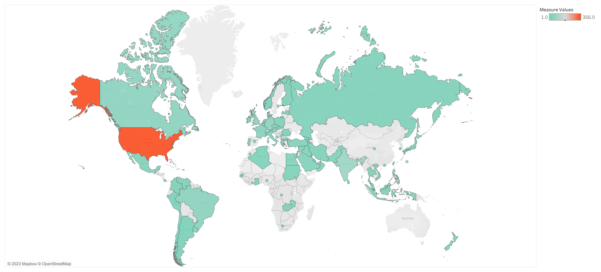

# LinkedIn Data Analysis

## Overview
This repository contains a dataset of real LinkedIn profiles, along with a Tableau visualization that displays an interactive world map to analyze which countries are most represented in the dataset. This README file provides an overview of the dataset, its contents, and instructions for using the Tableau visualization.

## Dataset Details
- **File Name**: `LinkedIn people profiles datasets.csv`
- **Contents**:
  - `name`: Name of the LinkedIn account holder.
  - `city`: City of residence.
  - `country_code`: Country code of the residence.
  - `position`: Current job position.
  - `current_company`: Current company where the person works.
  - `educations_details`: Details about the person's education.
  - `field`: Field of expertise or study.
  - `title`: Professional title or designation.
  - `degree`: Highest education degree obtained.
  - `meta`: Additional metadata or information.
  - `start_year`: Start year for the current job position or education.
  - `end_year`: End year for the current job position or education.
  - `company`: Previous company or educational institution.
  - `position_titles`: Previous job positions.
  - `position_durations`: Durations for previous job positions.

## Data Cleaning
Before creating the visualization, the dataset was cleaned and preprocessed to remove any inconsistencies, missing values, and outliers. After that, I extracted important informations and created new columns. This ensures the quality and reliability of the analysis.

## Tableau Visualization
The Tableau visualization in this repository provides an interactive plot to analyze the representation of different countries in the LinkedIn dataset. You can use this visualization to explore the following insights:
- Distribution of LinkedIn users by country.
- Filter the data by various attributes such as job position, field of expertise, and education.
- Hover over data points on the map to view detailed information about LinkedIn users in a specific country.

 
## Usage
To use the Tableau visualization, follow these steps:
1. Clone or download this repository to your local machine.
2. Open the Tableau workbook file using Tableau Desktop or Tableau Public.
3. Explore the visualization by interacting with the map and filters.
4. Analyze the distribution of LinkedIn users by country and other relevant attributes.

## Dependencies
- Tableau Desktop or Tableau Public to open and interact with the visualization.

## Credits
- Dataset source: [Kaggle](https://www.kaggle.com/datasets/manishkumar7432698/linkedinuserprofiles)

## Feedback and Contributions
If you have any feedback, suggestions, or would like to contribute to this project, please open an issue or create a pull request on GitHub.

Thank you for using this LinkedIn dataset and visualization. We hope you find it valuable for your analysis.
